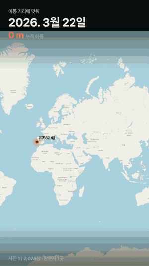

# photo-path

사진 속 위치 기록을 시간 순서대로 이어, 이동 경로를 **지도 애니메이션 영상**으로 만들어 줍니다.
설치도 회원가입도 없습니다 — 브라우저에서 열면 끝.

**▶ 바로 쓰기: https://photo-path.vercel.app**

> **개인정보 안내:** 사진과 JSON은 브라우저 안에서만 처리되며 서버에 업로드되지 않습니다. Vercel에는 접속·성능 정보가 전송될 수 있으며, 온라인 지도(CARTO·OpenStreetMap)를 사용하면 표시 지역을 추정할 수 있는 타일 요청도 해당 지도 서버로 전송됩니다.

<p align="center">
  
</p>

## 동작 흐름

두 개의 페이지가 하나의 파이프라인을 이룹니다.

```
사진 폴더 ─▶ [사진 위치·시간 추출기] ─▶ photos-geo.json ─▶ [사진 이동 경로 지도] ─▶ mp4 · PNG
```

- **[사진 위치·시간 추출기](https://photo-path.vercel.app/photo-geo-extractor.html)** — 폴더 안의 모든 사진에서 위도·경도·촬영일시만 읽어 JSON으로 저장합니다.
- **[사진 이동 경로 지도](https://photo-path.vercel.app)** — 그 JSON을 끌어다 놓으면 이동 경로를 재생하고 영상으로 저장합니다. 추출기를 거치지 않은 구글 위치기록·GeoJSON 등도 그대로 읽습니다.

## 주요 특징

- **사진과 JSON을 업로드하지 않습니다.** 추출과 렌더링은 모두 브라우저 안에서 처리됩니다.
- **형식을 가리지 않습니다.** 키 이름과 중첩 구조를 스스로 찾아 좌표·시각을 읽고, 위도와 경도가 뒤바뀐 파일도 자동으로 바로잡습니다.
- **릴스·쇼츠용 세로 9:16 영상**을 바로 저장합니다 (mp4, 미지원 브라우저는 webm).
- **10만 장도 처리합니다.** 이미지를 디코딩하지 않고 파일 앞부분 64KB만 읽으므로 메모리 사용이 일정합니다.
- **의존성·빌드가 없습니다.** 순수 HTML/JS 정적 파일 8개가 전부입니다.

## 빠른 시작

1. 좌표가 담긴 JSON이 없다면 — [추출기](https://photo-path.vercel.app/photo-geo-extractor.html)에서 사진 폴더를 선택하고 **추출 시작** → JSON 저장 (Chrome·Edge 권장).
2. [지도 페이지](https://photo-path.vercel.app)에 JSON 파일을 끌어다 놓습니다.
3. **▶ 재생**으로 확인하고, 마음에 들면 **● 영상 저장**.

재생 방식(이동 거리에 맞춰 · 사진 순서대로 · 실제 시간 흐름), 카메라(자동 줌 · 따라가기 · 고정), 지도 배경 5종, 테마와 경로 색은 화면의 컨트롤에서 바로 바꿀 수 있습니다.

## 지원 형식

**지도에 넣을 수 있는 파일**

| 형식 | 비고 |
|---|---|
| 추출기 JSON | 아래 스키마 |
| GeoJSON | Feature / geometry 좌표 |
| 구글 위치기록 | Takeout의 `latitudeE7` 형식 |
| 구글 포토 Takeout | 사진별 메타데이터 JSON |
| NDJSON · CSV · TSV | 열 이름 자동 인식 |

**추출기가 읽는 이미지** — JPEG · HEIC/HEIF · AVIF · PNG · WebP · TIFF/DNG, 그리고 TIFF 기반 RAW(CR2·NEF·ARW 등). 대상 확장자 목록은 화면에서 수정할 수 있습니다.

## 추출기 JSON 스키마

```json
[{ "path": "2026/IMG_0001.jpg", "lat": 40.4168, "lon": -3.7038,
   "alt": 655.1, "taken": "2026-04-25T14:03:12", "tz": "+02:00",
   "takenUtc": "2026-04-25T12:03:12Z", "gpsUtc": "2026-04-25T12:03:10Z",
   "model": "iPhone 15 Pro", "size": 3145728 }]
```

값이 없는 필드는 생략됩니다. `taken`은 카메라 로컬 시각, `gpsUtc`는 GPS가 기록한 UTC입니다.
위도·경도가 없는 사진은 결과에서 항상 제외되며, 사유는 화면의 **제외된 사진** 목록에서 확인할 수 있습니다.

## 문제 해결

| 증상 | 해결 |
|---|---|
| 영상 저장이 안 됨 | 지도 배경을 **내장 벡터 (오프라인)** 로 바꾸면 항상 됩니다 |
| 추출기가 "호환 모드"로 뜸 | 폴더 스트리밍 API(File System Access)가 없는 브라우저입니다. Chrome·Edge에서 훨씬 빠릅니다 |
| 무엇을 읽었는지 궁금함 | 파일을 넣은 뒤 인식 결과의 **자세히**에서 어떤 키를 좌표·시간으로 읽었는지 보여줍니다 |
| 로컬에서 열면 느림 | `file://`로 열면 워커를 만들 수 없습니다. 아래처럼 웹서버로 여세요 |

<details>
<summary><b>개발자 정보</b></summary>

### 로컬 실행

빌드가 없으므로 정적 서버 하나면 됩니다.

```bash
python -m http.server 8642
```

`http://127.0.0.1:8642` 가 지도, `/photo-geo-extractor.html` 이 추출기입니다.

### 파일 구성

| 파일 | 역할 |
|---|---|
| `index.html` | 지도 페이지 마크업 |
| `photo-map.app.js` | 상태 · 재생 루프 · 녹화 · UI 배선 |
| `photo-map.render.js` | 타일 레이어 · 테마 |
| `photo-map.geo.js` | 웹 메르카토르 투영 · 거리 계산 · 내장 해안선 디코더 |
| `photo-map.ingest.js` | 형식 자동 인식 인제스터 (키 추론 · 좌표 교정) |
| `photo-map.data.js` | 내장 벡터 해안선 데이터 (델타 인코딩 문자열) |
| `photo-map.css` | 지도 페이지 스타일 |
| `photo-geo-extractor.html` | 추출기 — UI · EXIF 파서 · 워커 풀이 한 파일에 |

외부 라이브러리·프레임워크·빌드 도구를 쓰지 않습니다. EXIF 파서는 픽셀을 디코딩하지 않고
컨테이너(JPEG · ISOBMFF · PNG · WebP · TIFF)에서 TIFF/IFD 블록만 찾아 읽습니다.

### 배포

`main` 브랜치가 Vercel로 배포됩니다. 배포 도메인에서만 Vercel 방문 통계 스크립트가 로드되며,
사진·JSON 데이터와는 무관합니다.

</details>

## 지도 타일 출처

배경 지도는 © OpenStreetMap contributors · © CARTO 타일을 사용하며, 저장되는 영상·PNG에
저작자 표시가 자동으로 포함됩니다. 이 표시는 지우지 말고 그대로 쓰세요.
내장 벡터 지도는 저장소에 포함된 데이터로, 외부 요청 없이 동작합니다.

## 라이선스

[MIT](LICENSE)
